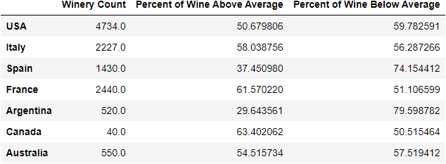
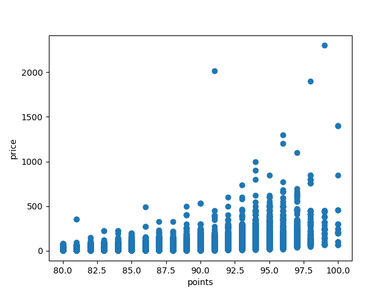

# exploratory-data-analysis-wine
The data for this exploratory analysis comes from Kaggle and examines wine data scraped from WineEnthusiast during the week of June 15th, 2017.

Tools Used: Jupyter Notebook, Matplotlib, Numpy and Scipy Stats

Initial questions about the dataset?
* what country represents where most the wines in the dataset come from?
* Is there a correlation between price of wine and the points that it is rewarded?
* How many wineries are represented in the dataset? Which winery has the most wines entered?
* what country do the best wines come from? What variety of wine is considered the best(tends to get the most points)?
* how many different varieties are there?
* what wine has the best point score and what is the most expensive wine?
* what is the wine that has the lowest score and what is the cheapest wine on the list?
* what percentage of the wines from each of the countries have a score above 88 points and below 88 points? 
 
## Insights obtained throuhgout the project:

As I began exploring and cleaning the dataset scraped from WineEnthusiast, I determined that columns (Unnamed, Description, region_2 and designation) were not needed and therefore removed. I then decided that the best way to showcase the distribution and frequency of wine scores was with a histogram shown below.

I utilized the .describe() function to determine the summary statistics for the points and found that the average or mean point value for the wines in the dataset was 87.86 (rounded). The summary stats also provided the standard deviation of 3.28 showing ** I also used the same function do find the summary statistics of price as well which resulted in **

From then a boxplot was used to display outlier point values from each country. 

As you can see in the chart above Italy has the most outliers in the dataset with a majority of the outliers with the other countries are above 95 points. With that information being known I thought it was important to display the most expensive, cheapest, wine with the highest number of points and lowest. The most expensive wine in the data set was ('Bordeaux-style Red Blend', 'France', 'Château Latour'). The cheapest was ('Chardonnay', 'US', "Pam's Cuties").The wine with the highest score was('Bordeaux-style White Blend', 'France', 'Château Haut-Brion'). Finally the wine with the lowest score was ('Chardonnay', 'Argentina', 'Tres Exilios').

Within the entire dataset, there were a total of 460 different varieties explore with the most popular wine variety being a Pinot Noir that was shown a total of 12193 times in the dataset.The number of wineries that are represented in the dataset were 11,859 throughout all 7 countries with the winery that was most represented was Williams Seylem in California. California had the most wines in the dataset with over 60,000 wines and Canada had the least with under 10,000.

It was important to display what countries produced the most wines in the dataset which is displayed in the bar chart below because it is a good lead off question for future research also I wanted to determine if the countries that were producing the most wines were the best wines or was it just that there was an overabundance of competition.

To further examine each country specifically I utilized the pie chart below which shows the percentage of wines from Argentina that fall within each point value. I only used this once because I think this could be used to dive into country specifics but wasnt my main focus initial research. 

In order to determine which country had produced the better wine I used .loc to seperate the wines that were above 88 points and those that were below 88 and then divided that number from the overall wine count for each country. I think it is important to know how the wines scored to see what country produced the best quality wine. As you can see below although Canada only has 40 wineries represented in study they have over 63% of their wine that is above average. Similar to France who as 2440 wineries and 61% is above average. 

Following this I wanted to see if there was a correlation between the point value and the price for the wine which I found using the .corr() function and then plotted in a scatter plot which you can see below. 

Unfortuantely I believe there is a weak correlation between price and points and the score does not represent what the price will be I think there are alot of other factors that were not available in this dataset. Overall you can see the that main take aways from the exploratory data analysis is that of the seven countries the USA produces the most wine from the data analysis, but just because they produce the most doesnt mean it is the best quality. One could argue that the best wine comes from France or Canada but I think these numbers could be used to eventually do more research into the resources and costs involved with each country and what resources are put into their wine industry. Additionally it can be used to determine which wine variety is the most popular by country and what region of the country produces that variety. Also then comparing costs of the wine with the ingredients to further determine why the costs of some of the wines are so high. (do they come from local wineries or more mass produced wineries?).    
 

