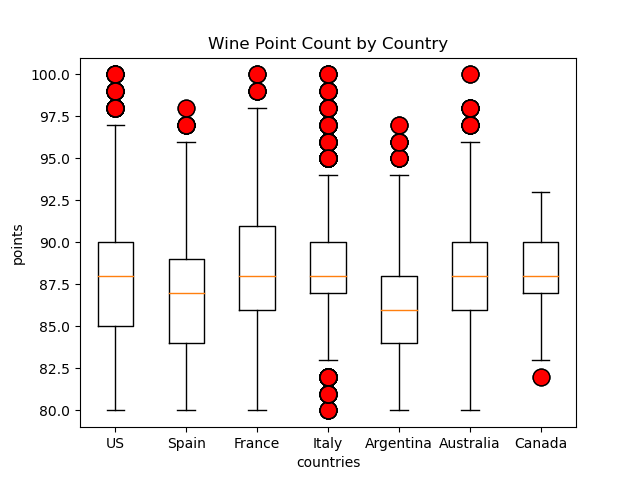
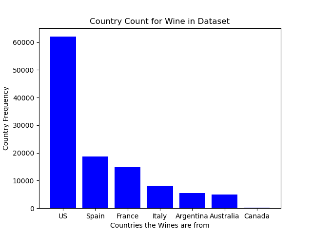
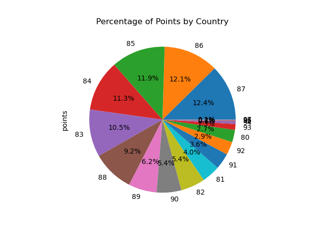

# exploratory-data-analysis-wine
The data for this exploratory analysis comes from Kaggle and examines wine data scraped from WineEnthusiast during the week of June 15th, 2017.

What are the questions were to be solved?
* what country represents where most the wines in the dataset come from?
* Is there a correlation between price of wine and the points that it is rewarded?
* How many wineries are represented in the dataset? Which winery has the most wines entered?
* what country do the best wines come from? What variety of wine is considered the best(tends to get the most points)?
* how many different varieties are there?
* what wine has the best point score and what is the most expensive wine?
* what is the wine that has the lowest score and what is the cheapest wine on the list?
* what percentage of the wines from each of the countries have a score above 88 points and below 88 points? 
 
## Insights obtained throuhgout the project:

As I began exploring and cleaning the dataset scraped from WineEnthusiast, I determined that columns (Unnamed, Description, region_2 and designation) were not needed and therefore removed. I then decided that the best way to showcase the distribution and frequency of wine scores was with a histogram shown below.

I utilized the .describe() function to determine the summary statistics for the points and found that the average or mean point value for the wines in the dataset was 87.86 rounded which also provided the standard deviation of 3.28 showing **

From then a boxplot was used to display outlier points for each country. 

As you can see in the chart above*

I then went through and thought it was important to display the most expensive, cheapest, wine with the highest number of points and lowest.
The most popular wine variety was *

The number of wineries present  and the winery most represented in the dataset *

I then thought it was important to display what countries produced the most wines in the dataset which is displayed in the bar chart below.

The pie chart below describes the percentage of wines from Argentina that fall within each point value.

One of the problems that I have run into was I thought it was important to display the percentage of wine from each country that had either above average wine or below average wine to try and display which country produced the better quality wine according the WineEnthusiast Standard however when creating the data frame one of the issues I ran into was the pandas Dataframe function was not working**
Following this I wanted to see if there was a correlation between the point value and the price for the wine which I found using the .corr() function and then plotted in a scatter plot which you can see below. 

 

